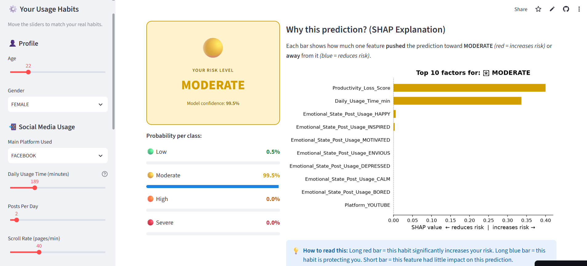
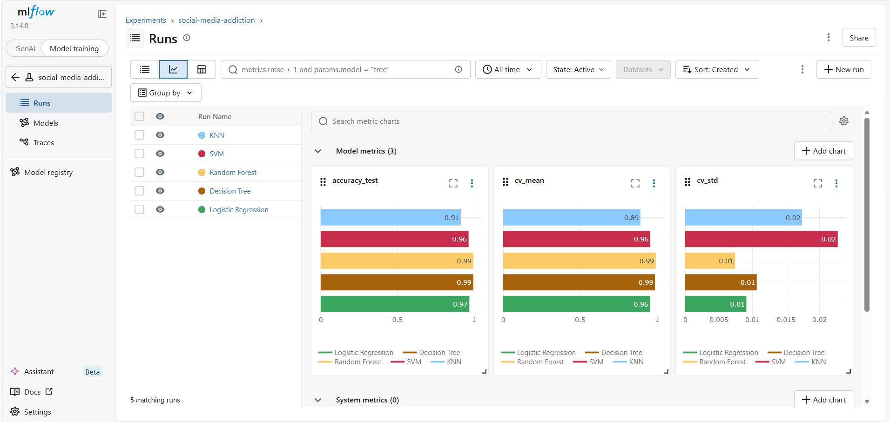

#  Social Media Addiction Prediction

> An end-to-end Machine Learning project that predicts social media addiction risk level and explains the result — deployed as an interactive web application.

[](https://social-media-addiction-prediction-mrxhwrpzucktxtbxuiox3e.streamlit.app/)
[](https://github.com/shaymajb/social-media-addiction-prediction)


---

##  Project Overview

This project classifies social media users into 4 addiction risk levels — **Low, Moderate, High, Severe** — based on 13 behavioral and psychological features. The model is deployed as an interactive web app where a user fills in their habits and immediately receives their risk level with a SHAP-powered explanation of what's driving the prediction.

**What makes this project different from a standard Kaggle notebook:**
- Full data cleaning pipeline on a deliberately messy raw dataset
- 5 ML models trained, cross-validated, and compared with MLflow experiment tracking
- SHAP explainability — the model explains every individual prediction
- Deployed live on Streamlit Cloud — accessible by anyone, anywhere

---

##  Live Demo

**Try the app:** [social-media-addiction-prediction.streamlit.app](https://social-media-addiction-prediction-mrxhwrpzucktxtbxuiox3e.streamlit.app/)

> Move the sliders to match your real habits → click **Predict** → get your risk level + SHAP explanation



---

##  Model Results

| Model | Test Accuracy | Cross-Val (5-fold) | CV Std |
|---|---|---|---|
| Logistic Regression | 96.94% | 95.53% | ± 0.91% |
| **Decision Tree** ⭐ | **99.49%** | **98.73%** | ± 1.07% |
| Random Forest | 99.49% | 99.24% | ± 0.74% |
| SVM | 96.43% | 95.66% | ± 2.27% |
| KNN | 91.33% | 89.28% | ± 1.74% |

**Best model: Decision Tree** — 99.49% accuracy, validated across 5 folds.

> **Note:** High accuracy is expected on this dataset as it was generated with clear behavioral rules. In a real-world clinical dataset, 75–85% would be more typical. The pipeline, explainability layer, and deployment are the transferable components.

### MLflow Experiment Tracking

All 5 model runs are tracked with MLflow — accuracy, cross-validation mean, and standard deviation logged per run.



---

##  Project Structure

```
social-media-addiction-prediction/
│
├── data/
│   ├── social_media_addiction.csv     ← raw dataset (with real issues)
│   └── cleaned_social_media.csv       ← output of cleaning.py
│
├── models/
│   ├── best_model.pkl                 ← saved Decision Tree
│   ├── scaler.pkl                     ← saved StandardScaler
│   └── feature_names.pkl             ← saved feature column list
│
├── plots/
│   ├── accuracy_comparison.png
│   ├── cross_validation.png
│   ├── confusion_matrix.png
│   ├── feature_importance.png
│   ├── shap_summary.png
│   └── shap_beeswarm_high.png
│
├── screenshots/                       ← README images
├── cleaning.py                        ← Step 1: data preprocessing
├── models.py                          ← Step 2: training + evaluation + SHAP + MLflow
├── app.py                             ← Step 3: Streamlit web application
├── requirements.txt
└── README.md
```

---

##  Dataset

**980 clean rows** · **15 columns** · **4 balanced classes** (245 per category)

| Feature | Type | Description |
|---|---|---|
| `Age` | Numeric | User age (13–60) |
| `Gender` | Categorical | Male / Female / Non-Binary |
| `Platform` | Categorical | Instagram, TikTok, YouTube, etc. |
| `Daily_Usage_Time_min` | Numeric | Minutes spent daily on social media |
| `Posts_Per_Day` | Numeric | Posts published per day |
| `Likes_Received_Daily` | Numeric | Daily likes received |
| `Comments_Received_Daily` | Numeric | Daily comments received |
| `Messages_Sent_Daily` | Numeric | Daily messages sent |
| `Scroll_Rate_ppm` | Numeric | Scrolling speed (pages per minute) |
| `FOMO_Score` | Numeric | Fear of Missing Out (1–10) |
| `Mental_Health_Index` | Numeric | Mental health score (20–100) |
| `Productivity_Loss_Score` | Numeric | Self-reported productivity loss (1–10) |
| `Emotional_State_Post_Usage` | Categorical | Mood after using social media |
| **`Addiction_Level`** | **Target** | **LOW / MODERATE / HIGH / SEVERE** |

---

##  Data Cleaning Pipeline (`cleaning.py`)

The raw dataset contains real-world quality issues handled step by step:

| Issue | Count | Fix |
|---|---|---|
| Missing numeric values | ~80 per column | Filled with **median** |
| Missing categorical values | ~63 per column | Filled with **mode** |
| Missing target values | 5 rows | **Dropped** |
| Duplicate rows | 20 | **Removed** |
| Impossible values (usage = -30 or 9999 min) | 15 rows | **Filtered** [0, 1440] |
| Inconsistent casing (`male`, `MALE`, `Male`, `M`) | Many | Normalized to **UPPERCASE** |

**Result:** 1020 raw rows → **980 clean rows**, 0 missing values, 0 duplicates.

---

##  ML Pipeline (`models.py`)

```
Raw features (13 inputs)
        │
        ▼
One-Hot Encoding  (Gender, Platform, Emotional State → 0/1 columns)
        │
        ▼
Ordinal Encoding  (Target: LOW=0, MODERATE=1, HIGH=2, SEVERE=3)
        │
        ▼
Stratified Train/Test Split  (80% train / 20% test)
        │
        ▼
StandardScaler normalization  (fit on train only)
        │
        ▼
5 Models trained + Cross-Validation (5-fold) + MLflow logging
        │
        ▼
Accuracy · Precision · Recall · F1-Score per class
        │
        ▼
Best model saved with joblib  (model.pkl + scaler.pkl + feature_names.pkl)
        │
        ▼
SHAP explanations generated  (beeswarm + summary charts)
```

---

##  SHAP Explainability

The model doesn't just predict — it explains. SHAP (SHapley Additive exPlanations) calculates how much each input feature pushed a prediction toward or away from each risk level.

**Example:** For a MODERATE prediction:
- `Productivity_Loss_Score` → strong positive push (increases risk)
- `Daily_Usage_Time_min` → moderate positive push (increases risk)
- `Mental_Health_Index` → negative push (reduces risk)


---

##  Streamlit App (`app.py`)

The web app has 3 sections:

**Sidebar** → 13 sliders and dropdowns for user habits (age, platform, daily usage, FOMO score, etc.)

**Left panel** → Color-coded risk card with confidence percentage + probability breakdown per class:
- 🟢 LOW · 🟡 MODERATE · 🟠 HIGH · 🔴 SEVERE

**Right panel** → SHAP bar chart showing top 10 features that influenced the prediction, with direction (red = increases risk, blue = reduces risk)

---

##  How to Run Locally

```bash
# 1. Clone the repository
git clone https://github.com/shaymajb/social-media-addiction-prediction.git
cd social-media-addiction-prediction

# 2. Install dependencies
pip install -r requirements.txt

# 3. Clean the raw data
python cleaning.py

# 4. Train the models
python models.py

# 5. Launch the web app
streamlit run app.py

# 6. View MLflow experiment dashboard
mlflow ui
```

---

##  Tech Stack

| Tool | Role |
|---|---|
| `pandas` | Data manipulation and cleaning |
| `scikit-learn` | ML models, preprocessing, evaluation |
| `SHAP` | Model explainability |
| `MLflow` | Experiment tracking and comparison |
| `joblib` | Model serialization |
| `Streamlit` | Interactive web application |
| `matplotlib` / `seaborn` | Data visualization |

---

##  What I Learned

- How to build a **complete supervised ML pipeline** from raw messy data to deployed app
- Why **cross-validation** is more reliable than a single train/test split
- How **SHAP** turns a black-box model into an interpretable tool
- Why **`stratify=y`** matters in multi-class problems
- How **MLflow** tracks experiments so you never lose a result
- How to deploy a Python app publicly for free with **Streamlit Cloud**

---

##  Possible Next Steps

- [ ] Hyperparameter tuning with `GridSearchCV`
- [ ] Fairness analysis across gender and age groups
- [ ] Collect real Screen Time export data from volunteers
- [ ] Add ROC curves per class

---

##  Author

**Chaima Jebali** — Computer Science & Data Science Student

[](https://linkedin.com/in/your-profile)
[](https://github.com/shaymajb)

---

##  License

Academic project — free to use and adapt with credit.
